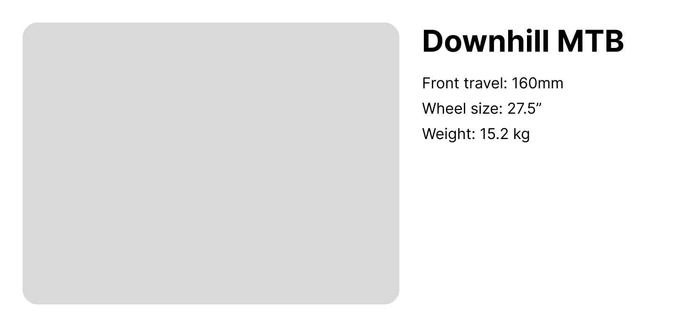

The [Description List (`<dl>`) element](https://developer.mozilla.org/en-US/docs/Web/HTML/Element/dl) is useful for many common visual design patterns, but is unfortunately underutilized.

It was originally intended to group terms with their definitions, but it's also a great fit for other content that has a key/value structure, such as product attributes or cards that have several supporting details.

Developers often mark up these patterns with overused heading or table semantics, or neglect semantics entirely. With the Description List (`<dl>`) element and its dedicated Description Term (`<dt>`) and Description Definition (`<dd>`) elements, we can improve the semantics and accessibility of these design patterns.

The `<dl>` has a unique content model:
- A parent `<dl>` containing one or more groups of `<dt>` and `<dd>` elements
- Each term/definition group can have multiple `<dt>` (Description Term) elements per `<dd>` (Description Definition) element, or multiple definitions per term
- The `<dl>` can optionally accept a single layer of `<div>` to wrap the `<dt>` and `<dd>` elements, which can be useful for styling

## Examples

An initial example would be a simple list of terms and definitions:


```html
<dl>
	<dt>Compression damping</dt>
	<dd>Controls the rate a spring compresses when it experiences a force</dd>
	<dt>Rebound damping</dt>
	<dd>Controls the rate a spring returns to it's extended length after compressing</dd>
</dl>
```

A common design pattern is "stat callouts", which feature mini cards of small label text above large numeric values. The `<dl>` is a great fit for this content:


```html
<dl>
	<div>
		<dt>Founded</dt>
		<dd>1988</dd>
	</div>
	<div>
		<dt>Frames built</dt>
		<dd>8,678</dd>
	</div>
	<div>
		<dt>Race podiums</dt>
		<dd>212</dd>
	</div>
</dl>
```

And, a final example of a product listing, which has a list of technical specs:



```html
<h2>Downhill MTB</h2>

<dl>
	<div>
		<dt>Front travel:</dt>
		<dd>160mm</dd>
	</div>
	<div>
		<dt>Wheel size:</dt>
		<dd>27.5"</dd>
	</div>
	<div>
		<dt>Weight:</dt>
		<dd>15.2 kg</dd>
	</div>
</dl>
```

## Accessibility

With this markup in place, [common screen readers will convey important semantic and navigational information](https://a11ysupport.io/tech/html/dl_element). In my testing, NVDA on Windows and VoiceOver on MacOS conveyed a list role, the count of list items, your position in the list, and the boundaries of the list. TalkBack on Android only conveyed the term and definition roles of the `<dt>` and `<dd>` elements, respectively.
<!-- MM: Is this true for all common screen readers? Did you test this? If no, can you?
Also, maybe you'll find more info here:
https://benmyers.dev/blog/on-the-dl/
https://a11ysupport.io/tech/html/dl_element
-->
<!-- DL: I added my testing experience above. Thank you for providing these links. I added a link to Ben's article at the end as further reading. We coincidentally had very similar content, so I revised the intro sentence to avoid overlapping with Ben's intro. -->

If the design doesn't include visible labels, you can at least include them as visually hidden text for assistive technology users. But, I always advocate to visually display them if possible.

## Wrapping up

The `<dl>` is a versatile element that unfortunately doesn't get much use. In over a decade of coding, I've almost never encountered it in existing codebases. It also doesn't appear anywhere in the top HTML elements lists in [the Web Almanac 2024](https://almanac.httparchive.org/en/2024/markup#element-diversity) or [an Advanced Web Ranking study of over 11.3 million pages](https://www.advancedwebranking.com/seo/html-study). The next time you're building out a design, look for opportunities where the underrated Description List is a good fit.

<!-- MM: "unfortunately doesn't get much use". Now I'm wondering if there's data to back this claim. It's not important. It would just be interesting. Maybe there's something in th web alamanc? https://almanac.httparchive.org/en/2024/markup#top-elements -->
<!-- DL: I added the Web Almanac link and linked another wide-scale study, as well as a mention of personal experience. -->

To go deeper, be sure to check out this [article by Ben Myers on the `<dl>` element](https://benmyers.dev/blog/on-the-dl/).
