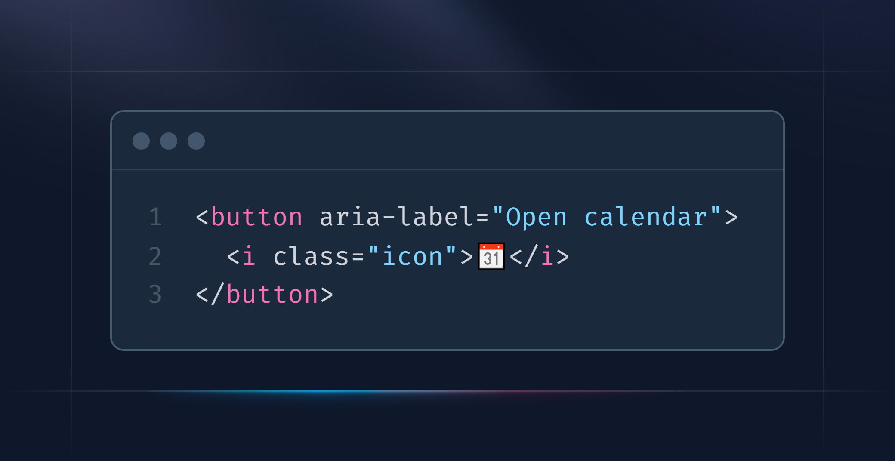
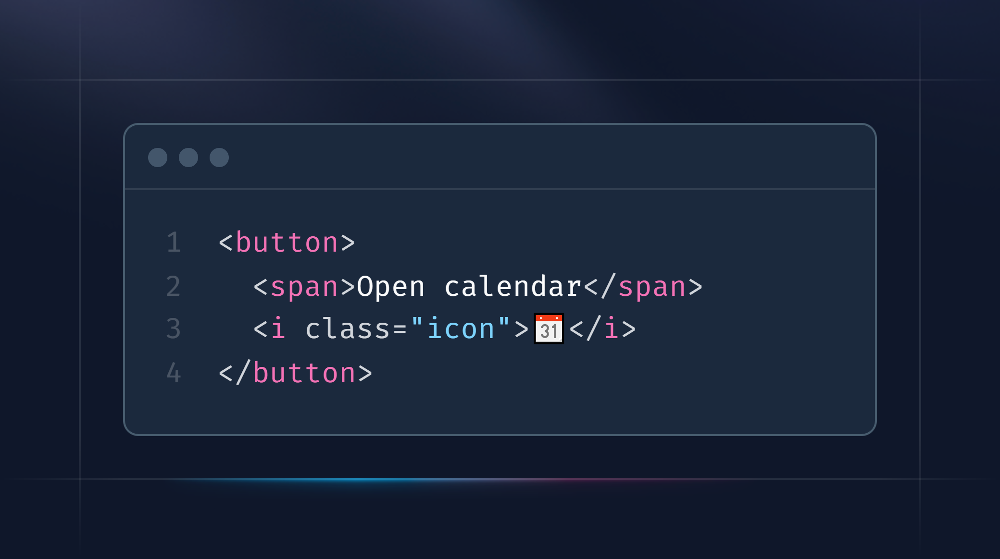
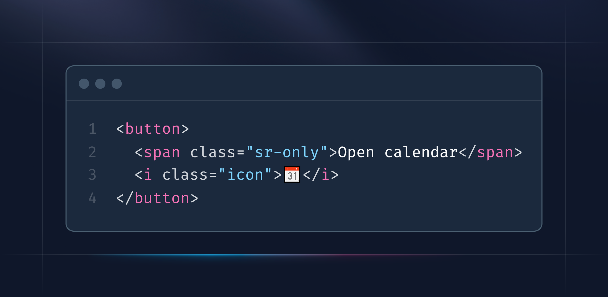
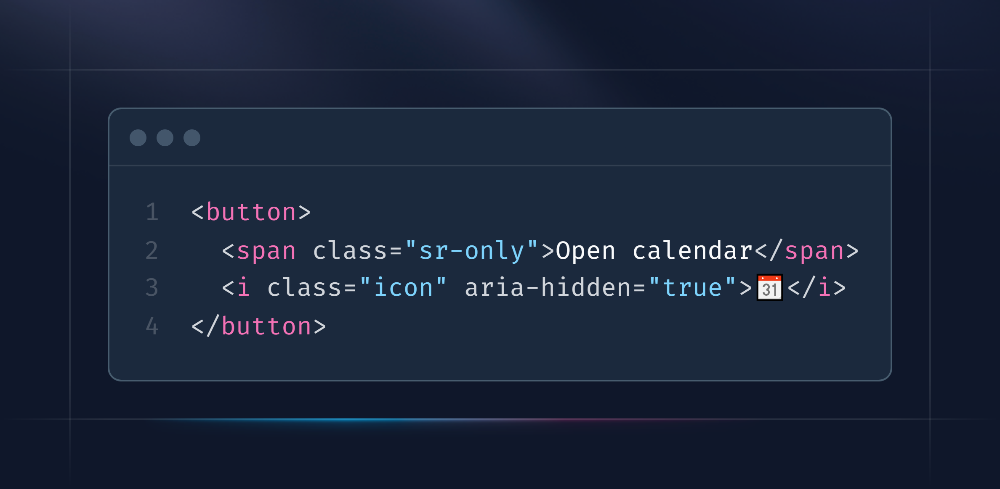

# Introduction

Imagine you’re tasked with building a cool new feature for a product. You dive into the work with full energy, and just
before the deadline, you manage to finish it. Everyone loves your work, and the feature is set to go live the next day.
A few days later, you receive an email from a user who can’t access the new feature. The user points out that they don’t
understand what the button does. What do they mean? You review your code, locate the button, and start digging into the
problem.


```html

<button>
  <i class="icon">📆</i>
</button>
```

# The Problem

You find some good resources explaining that there are people with disabilities who need to be considered in these
cases. This is known as accessibility. For example, some individuals have motor impairments and cannot use a mouse. In
this particular case, the user is visually impaired and relies on assistive technology like a screen reader, which reads
aloud the content of the website or software. The button you implemented doesn’t have any descriptive text, so only the
icon is read aloud. In your case, the screen reader says, “Tear-Off Calendar button”. While it describes the appearance
of the icon, it doesn’t convey the purpose of the button. This information is meaningless to the user. A button should
always describe what action it will trigger when activated. That’s why we need additional descriptive text.

# The Challenge

Okay, you understand the problem now and agree that it should be fixed. However, you don’t want to add visible text to
the button. For design and aesthetic reasons, sighted users should only see the icon. Is there a way to keep the button
“icon-only” while still providing a meaningful, descriptive text for users who rely on assistive technologies like
screen readers?

# The Solution

In HTML, you are allowed to use specific attributes for accessibility, and in this case, the attribute **aria-label** is
what
you need. ARIA stands for “Accessible Rich Internet Applications” and is an initiative to make websites and software
more accessible to people with disabilities.

With **aria-label**, you can assign a descriptive, accessible text to a button without it being visible to sighted
users.
The purpose of **aria-label** is to provide a description for interactive elements that lack a visible label or
descriptive
text. All you need to do is add the attribute **aria-label** to the button.



```html

<button aria-label="Open Calendar">
  <i class="icon">📆</i>
</button>
```

With this adjustment, the screen reader will now announce “Open calendar”, completely ignoring the icon. This clearly
communicates to the user what the button will do when clicked.

# Alternatives

There is another alternative, though it is a bit more cumbersome to implement. Instead of using the **aria-label**, you
can
place the text for the screen reader directly within the button element.



```html

<button>
  <span>Open Calendar</span>
  <i class="icon">📆</i>
</button>
```

However, this would make the text visible to sighted users as well. To prevent this, additional CSS is required.


```css
.sr-only {
  position: absolute;
  width: 1px;
  height: 1px;
  padding: 0;
  margin: -1px;
  overflow: hidden;
  clip: rect(0, 0, 0, 0);
  white-space: nowrap;
  border-width: 0;
}
```



```html

<button>
  <span class="sr-only">Open Calendar</span>
  <i class="icon">📆</i>
</button>
```

The CSS ensures that the text inside the span-element is hidden from sighted users but remains readable for screen
readers. This approach is so common that well-known CSS libraries like TailwindCSS, Bootstrap, and Material-UI include
such a class by default.

Since you’re no longer using the attribute **aria-label**, the entire content of the button will be read aloud,
including
the icon — something you want to avoid. ARIA provides an attribute to hide elements from screen readers so that their
content isn’t read. All you need to do is add the attribute **aria-hidden** with the value “true” to the icon element,
which
in this case is the “i”-element.



```html

<button>
  <span class="sr-only">Open Calendar</span>
  <i class="icon" aria-hidden="true">📆</i>
</button>
```

With this approach, you achieve the same result, just with a bit more code.

# Browser compatibility

Both **aria-label** and **aria-hidden** are supported by all modern browsers and can be used without concern. The only
exception is Internet Explorer. Microsoft has discontinued support for Internet Explorer, and if possible, it should no
longer be used due to security reasons.

# Conclusion

Ensuring accessibility in web design is more than just a nice-to-have—it’s a necessity. By implementing simple solutions
like **aria-label** or combining CSS with **aria-hidden**, you can create a user experience that is both aesthetically
pleasing and accessible for everyone, including those who rely on screen readers. While there may be different
approaches to solving accessibility challenges, the key is to be mindful of all users' needs. A few small adjustments
can make a world of difference, ensuring that your features are truly usable by everyone.

Cheers
Alex

# Resources / Links

- [Unicode Character “Tear-Off Calendar”](https://www.compart.com/en/unicode/U+1F4C6)
- [comport Unicode Website](https://www.compart.com/en/unicode/)
- [mdn web docs aria-label](https://developer.mozilla.org/en-US/docs/Web/Accessibility/ARIA/Attributes/aria-label)
- [mdn web docs aria-hidden](https://developer.mozilla.org/en-US/docs/Web/Accessibility/ARIA/Attributes/aria-hidden)
- [WAI-ARIA Standard Guidlines](https://www.w3.org/WAI/standards-guidelines/aria/)
- [Tailwind CSS Screen Readers (sr-only)](https://tailwindcss.com/docs/screen-readers)
